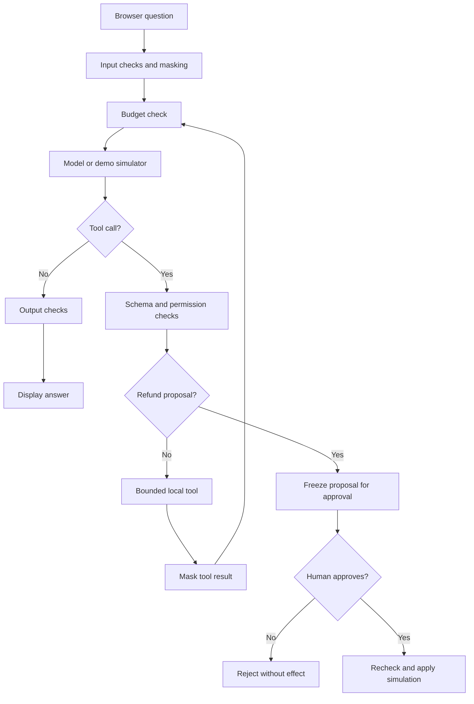

# How this project works

## Agent path

The audit records checks and outcomes throughout. The diagram's cycles are bounded by model rounds, tool calls, payload size, and time. There is no chain-of-thought display: the UI shows observable enforcement events.

## What makes live mode an agent?

An LLM is asked to solve a task using typed tools. It can select a tool and arguments, observe the result, and choose another action. `harness.py` orchestrates that loop. For example, the model can inspect a policy, retrieve an order, then propose a refund. The loop is different from a single question/answer call because the model's outputs can cause controlled local actions.

The model cannot execute arbitrary Python or directly call functions on the operating system. Only a validated call from `SCHEMAS` is dispatched. A refund tool creates a proposal and ends the current model loop. Approval is an independent HTTP action controlled by the human, not a tool exposed to the model. After approval, Python produces the confirmation without another billable LLM call.

## Provider messages

1. Send a system instruction, optional sanitized memory, current sanitized question, and four JSON tool schemas.
2. Receive an assistant message, potentially with `tool_calls`.
3. Validate the whole batch's shape, names, and typed arguments. A refund call must be alone in its batch.
4. Execute a read/calculation or create a pending refund proposal. Screen tool output.
5. For ordinary tools, append the assistant tool-call message and matching `role=tool` response with `tool_call_id`; repeat within limits.
6. Screen the final text before display and optional memory retention.

NexLLM mode uses the user-specified `https://www.nexllm.ai/v1` endpoint. Model IDs are account-specific. No OpenAI account/key is needed; the OpenAI-compatible format is the integration protocol. Unsupported tool-call shapes, invalid JSON, and truncated replies stop the run. There is no automatic fallback protocol.

## State and retention

| State | Location | Lifetime |
|---|---|---|
| API key | Python config from `.env`/OS | Until process stops; `.env` remains on disk |
| Conversation memory | Server RAM; max three sanitized question/answer pairs | Opt-in; off/clear/reset/session expiry/restart removes it |
| Visible chat | Current browser DOM; max 60 message bubbles | Reload/New sandbox clears it; no localStorage |
| Pending approval | Server RAM, random ID, frozen arguments | 120 seconds by default; consumed once or discarded on reset/session expiry/restart |
| Simulated ledger | Per-session RAM | Reset/session expiry/restart |
| Session | HttpOnly, SameSite cookie plus server RAM | 30 minutes idle; server restart; up to 32 sessions |
| Live-call count | Process RAM, shared across sessions | Restart only; failed submitted calls count |
| Audit metadata | `logs/audit.jsonl` and one rotated file | Kept on disk; each file approximately 2 MB maximum |

Memory consent covers server conversation context. A browser can still display the current conversation without storing it as context for the model. The pending action and simulated ledger exist independently of conversation-memory consent. Local audit metadata is always recorded. In live mode, the provider receives sanitized prompts, selected prior turns, tool schemas, and tool results; provider retention is governed by that service, not this RAM setting.

## Trust boundaries

- Browser text, LLM output, remembered text, and tool data are treated as untrusted.
- Python source, `.env`, and bundled data are trusted local configuration. A person who can edit these files can change the lab; the app is not protection against its own OS user.
- `LAB_ROLE` is a classroom role setting, not authenticated business identity.
- The host and endpoint are fixed in configuration and transport. There are no redirects or arbitrary fetch tools.
- The local server checks host, origin, JSON body size, CSRF token, and session. It serializes API work with a lock to prevent approval/budget races.
- API errors are summarized without raw bodies or secrets. Financial statements or real customer data are outside this lab's scope.

## Safe extensions for students

To add a tool, define its schema, exact server validation, permission rule, implementation, output screening, and adversarial tests. Do not add generic shell, URL-fetch, or arbitrary-file tools as a shortcut. For real actions, add authenticated identities, durable transactions, an independent approval service, idempotency keys, and real audit storage before replacing the simulation.
